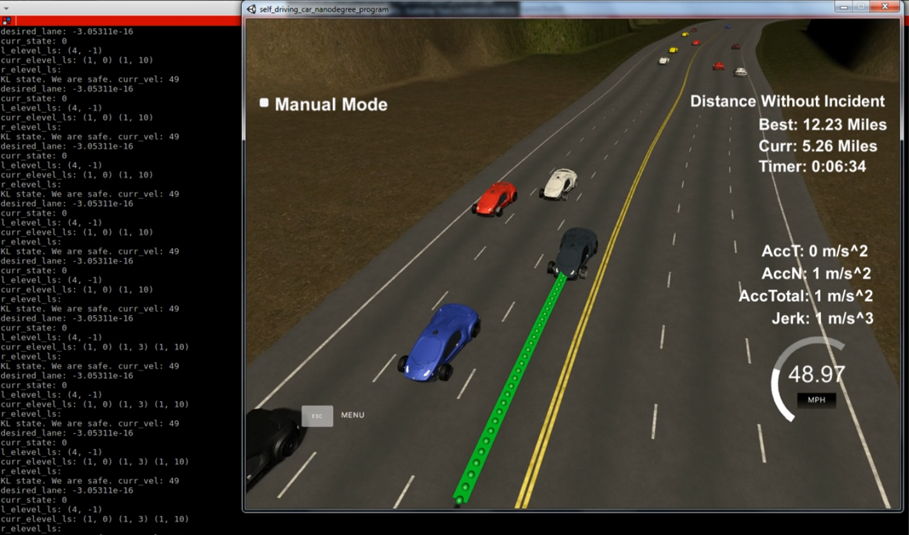

This report address the [rubric points](https://review.udacity.com/#!/rubrics/1020/view) described in the project specification showing the solution provided to each one.

---

### Compilation

#### 1. The code compiles correctly.

This code was developed, tested and compiled on an Ubuntu 16.04 LTS. It uses `cmake` along a *CMakeLists.txt* included in the repo for compilation. As the changes introduced in *CMakeLists.txt* since the original version provided by Udacity are minimum, it will be able to compile on any platform without any change.

### Valid Trajectories

#### 1. The car is able to drive at least 4.32 miles without incident.

Figure 1: The car is able to drive autonomously up to 12.23 miles.

As it is shown in Figure 1, with the provided code in this repo, the car is able to drive at least 12.23 miles without any incident, which is about 3x times longer than the milestone.

#### 2. The car drives according to the speed limit.

The speed limit is 50 mph. My design include 1 mph for security reasons, thus the maximum speed the car is going to reach is 49 mph. When the car detects there is an obstacle in it's lane, it tries to change lane in order to keep the target speed (49 mph) as constant as possible while regarding safety considerations	.

#### 3. Max Acceleration and Jerk are not Exceeded.

To avoid exceeding some constraints, some measures were taken:

First of all, the use of spline library to create smooth trajectories.
As there was the "cold start" problem, the initial speed was step-by-step increased until reaching the target speed.
In my implementation there was a issue when changing lanes. To make this step smoother I introduced in the FSM (Finite State Machine) a mechanism to make lane transition step-by-step.

#### 4. Car does not have collisions.

The car is able to predict in advance if the car in front will be in a dangerous position regarding itself. Thus, it's able to reduce it's speed enough to keep a safety gap between both. Also, when considering to change lane, it analyze it's surrounding to detect if there is any drivable space in the other lanes in order to start the maneuver.

#### 5. The car stays in its lane, except for the time between changing lanes.

As long as there is no a lane changing maneuver, the car will remain in the same d coordinate (Frenet space). When it reach the time to lane changing, it does the maneuver very smooth while limiting the time used for it to be below a reasonable threshold below the 3 seconds specified in the rubric.

#### 6. The car is able to change lanes

When the car detect there is an obstacle on its lane that makes it to reduce the speed, it starts checking for alternatives. In case there is a drivable lane and that lane is empty or safe to move on, it will start the maneuver by changing the FSM (Finite State Machine) to the PLCL (Prepare Lane Change Left) or PLCR (Prepare Lane Change Left) states. It will continue in one of those states until the changing lane maneuver is completed. Then transition to states LCL (Lane Change Left) or LCR (Lane Change Right) and inmediately go to KL (Keep Lane).

### Reflection

#### 1. There is a reflection on how to generate paths.

The main idea to generate path was extracted from the video walkthrough. It mainly consist on: after defining a starting reference, some points ahead in frenet coordinates are computed and added to an "anchor list". These points are evenly spaced by 30 m. To ease the maths with the spline library, these points are converted to local coordinate system. After that, the waypoints for the next 30 meters are obtained by interpolating the anchor points using splines. This is done taking into account the target speed and the simulator design which make the car to visit each point every 0.02 seconds. After that, every waypoint is transformed back to global coordinate system.

